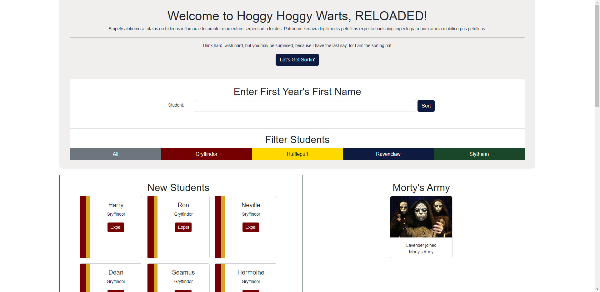

# Sorting Hat

## Overview of project

Sorting hat displays existing students, allows users to add new students, which will be randomly assigned to a house, and displayed by house. Students can also be expelled, placing them in Morty's Army, and removing them from the main student population.

## Link to Chie's wireframes/prototype

No wireframes were used.
The following was used as a prototype and was provided: https://user-images.githubusercontent.com/29741570/164943525-d20275be-c312-42d1-9730-0c1fd3fd9834.png

## Link to the deployed project
https://scb-sortinghat.netlify.app/

## Description of the user

Any user

## List of features

- Let's Start Sorting button to show form
- Student form allows new students to be added and sorted into a house randomly
- Filter buttons: filter student list by house, or select All to see all students
- Expel button removes student from Students list and puts them in Morty's Army (displayed upon first expelled student)

## Screenshots of project

Initial page load:

Form expanded and student expelled:

## List of contributors and links to their GH profiles

No contributors

## Link to Loom video walthrough of app
